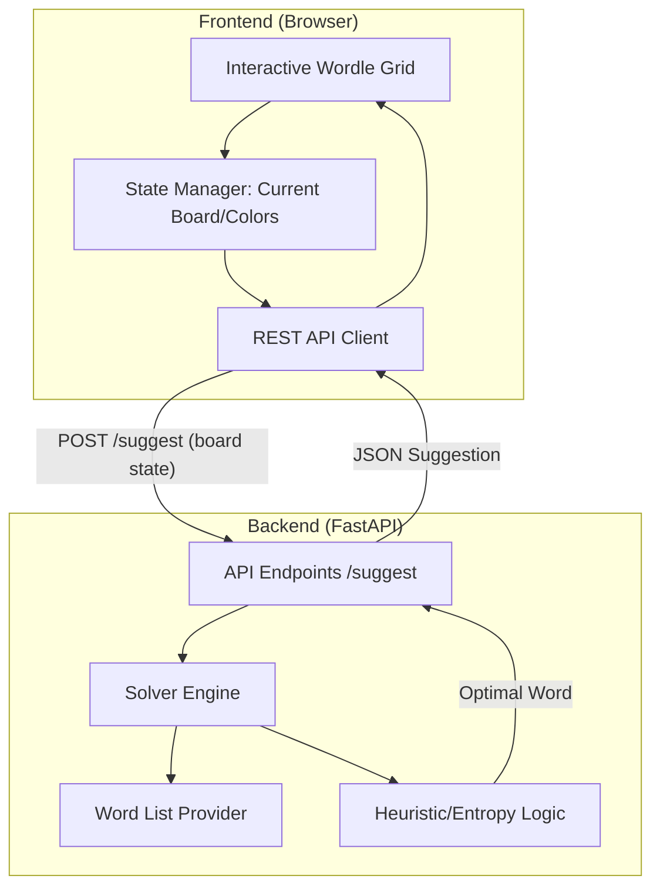

# Wordle Gemini Solver: Design Document

## Title and Overview
**Wordle Gemini Solver** is a web-based tool designed to assist players in solving Wordle puzzles. It uses an information-theory approach (Entropy Maximization) to suggest the most mathematically optimal guesses, helping users solve puzzles in the fewest steps possible.

## Functional Requirements
- **Word List Management:** Maintain two distinct lists: ~2,315 common target words and ~12,972 valid guess words.
- **Interactive Feedback:** A web-based grid where users can enter words and click individual tiles to cycle through colors (Gray -> Yellow -> Green).
- **Optimal Guessing Engine:**
    - Calculate the "Expected Entropy" for each potential guess to find the one that narrows down the search space the most.
    - Provide a list of the top 5 suggested words.
- **Hybrid Strategy:** 
    - If the remaining possible words exceed a threshold (e.g., 5,000), use a fast heuristic (Letter Frequency).
    - If the list is below the threshold, switch to the full Entropy calculation.
- **State Filtering:** Automatically filter the internal list of possible solutions based on the feedback provided by the user.

## Non-Functional Requirements
- **Performance:** Guess suggestions should be returned within 2 seconds.
- **Usability:** A clean, modern UI that mimics the Wordle experience.
- **Portability:** A Python-based backend (FastAPI) that runs locally on macOS and serves a web interface.
- **Simplicity:** No database required; the app runs as a single-instance local server.

## Architecture & Block Diagrams
The application follows a classic Client-Server architecture.

## Component Descriptions
- **Frontend (Vanilla HTML/CSS/JS):**
    - **Grid Component:** Handles 5x6 input fields.
    - **Color Toggler:** JavaScript logic to cycle tile background colors on click.
    - **Suggestion Panel:** Displays the recommended next word and its expected entropy score.
- **Backend (FastAPI):**
    - **Solver Engine:** The core logic that filters the ~2.3k target words based on "Green" (correct position), "Yellow" (wrong position), and "Gray" (not in word) constraints.
    - **Information Theory Module:** Performs the entropy calculation ($E[I] = \sum p(x) \log_2(1/p(x))$) across the guess list.
    - **Static File Server:** Serves the frontend assets.

## Design Decisions
1.  **Hybrid Heuristic:** To avoid "hanging" the UI on the first or second guess when the search space is massive, the system will use a letter-frequency heuristic until the candidate list is small enough for exhaustive entropy calculation.
2.  **Precomputed First Guess:** The very first optimal word (e.g., "SALET" or "CRANE") will be hardcoded to provide an instant start.
3.  **Stateless API:** The backend will not store the user's progress. The frontend will send the entire board state (all guesses and colors) with every request, allowing the backend to re-filter and calculate dynamically.
4.  **Vanilla Frontend:** Since the UI is relatively simple, we will use Vanilla CSS/JS to keep the project lightweight and avoid the overhead of heavy frameworks like React.
